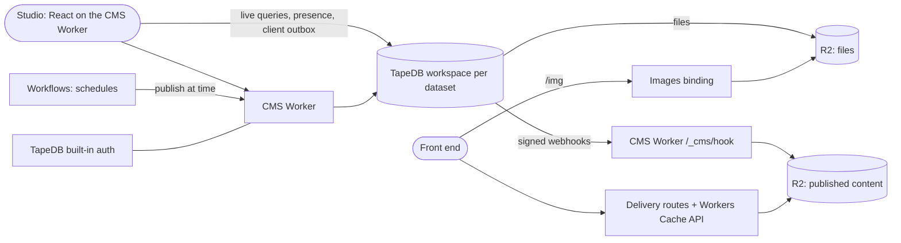

# Containers

```mermaid
flowchart LR
  studio([Studio: React on the CMS Worker]) -->|live queries, presence, client outbox| ws[(TapeDB workspace per dataset)]
  studio --> worker[CMS Worker]
  worker --> ws
  ws -->|files| files[(R2: files)]
  ws -->|signed webhooks| hook[CMS Worker /_cms/hook]
  hook --> content[(R2: published content)]
  fe([Front end]) --> delivery[Delivery routes + Workers Cache API] --> content
  fe -->|/img| images[Images binding] --> files
  sched[Workflows: schedules] -->|publish at time| worker
  auth[TapeDB built-in auth] --- worker
```
