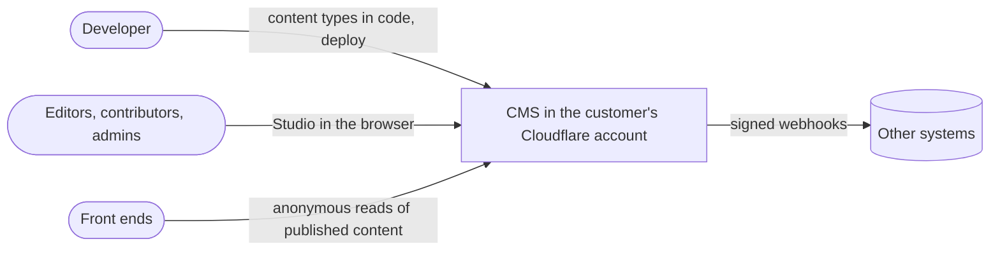

# Context

```mermaid
flowchart LR
  dev([Developer]) -->|content types in code, deploy| cms[CMS in the customer's Cloudflare account]
  ed([Editors, contributors, admins]) -->|Studio in the browser| cms
  fe([Front ends]) -->|anonymous reads of published content| cms
  cms -->|signed webhooks| ext[(Other systems)]
```
