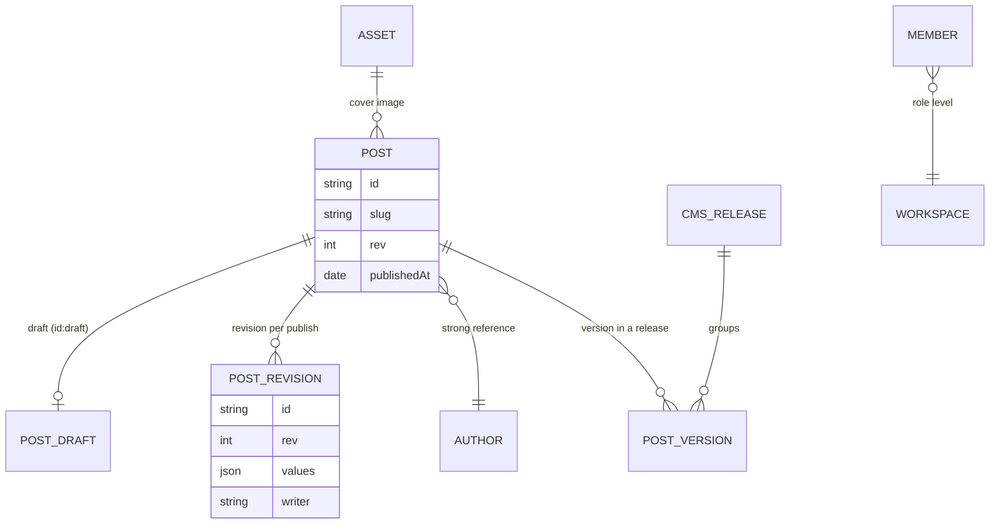

# Data model (one workspace per dataset)

```mermaid
erDiagram
  POST ||--o| POST_DRAFT : "draft (id:draft)"
  POST ||--o{ POST_REVISION : "revision per publish"
  POST }o--|| AUTHOR : "strong reference"
  CMS_RELEASE ||--o{ POST_VERSION : groups
  POST ||--o{ POST_VERSION : "version in a release"
  ASSET ||--o{ POST : "cover image"
  MEMBER }o--|| WORKSPACE : "role level"
  POST { string id string slug int rev date publishedAt }
  POST_REVISION { string id int rev json values string writer }
```
