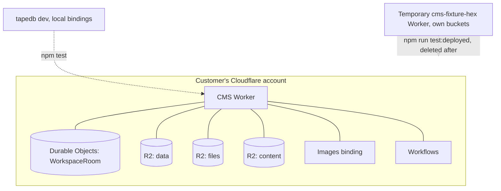

# Deployment

```mermaid
flowchart TB
  subgraph acct[Customer's Cloudflare account]
    w[CMS Worker] --- do[(Durable Objects: WorkspaceRoom)]
    w --- r2a[(R2: data)]
    w --- r2b[(R2: files)]
    w --- r2c[(R2: content)]
    w --- img[Images binding]
    w --- wf[Workflows]
  end
  local[tapedb dev, local bindings] -.->|npm test| w
  tmp[Temporary cms-fixture-hex Worker, own buckets] -.->|npm run test:deployed, deleted after| acct
```
