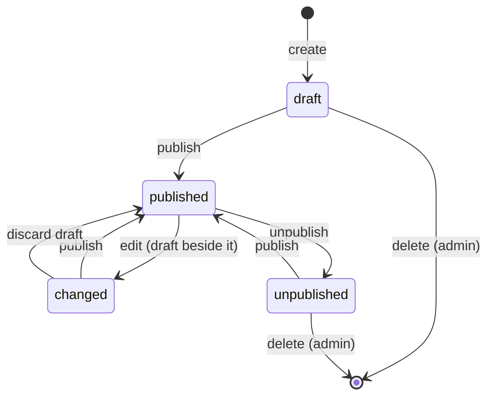

# Document lifecycle

```mermaid
stateDiagram-v2
  [*] --> draft: create
  draft --> published: publish
  published --> changed: edit (draft beside it)
  changed --> published: publish
  changed --> published: discard draft
  published --> unpublished: unpublish
  unpublished --> published: publish
  draft --> [*]: delete (admin)
  unpublished --> [*]: delete (admin)
```
