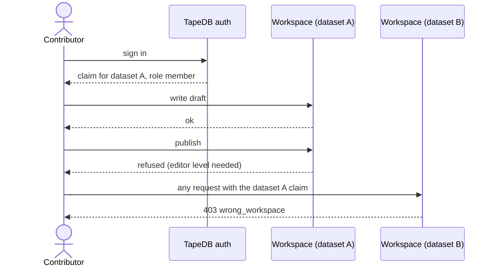

# UC-3 / UC-4 Roles and dataset isolation

```mermaid
sequenceDiagram
  actor C as Contributor
  participant A as TapeDB auth
  participant W1 as Workspace (dataset A)
  participant W2 as Workspace (dataset B)
  C->>A: sign in
  A-->>C: claim for dataset A, role member
  C->>W1: write draft
  W1-->>C: ok
  C->>W1: publish
  W1-->>C: refused (editor level needed)
  C->>W2: any request with the dataset A claim
  W2-->>C: 403 wrong_workspace
```
