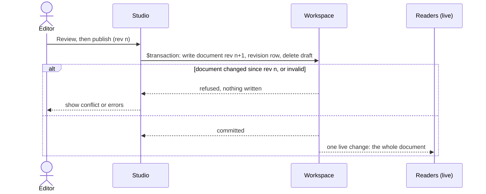

# UC-2 / UC-7 Publish a document from the Studio

```mermaid
sequenceDiagram
  actor E as Editor
  participant S as Studio
  participant W as Workspace
  participant R as Readers (live)
  E->>S: Review, then publish (rev n)
  S->>W: $transaction: write document rev n+1, revision row, delete draft
  alt document changed since rev n, or invalid
    W-->>S: refused, nothing written
    S-->>E: show conflict or errors
  else
    W-->>S: committed
    W-->>R: one live change: the whole document
  end
```
